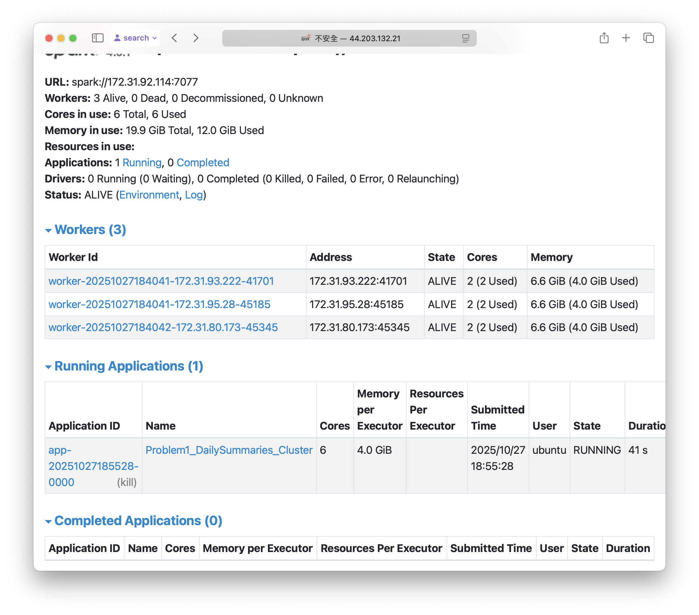
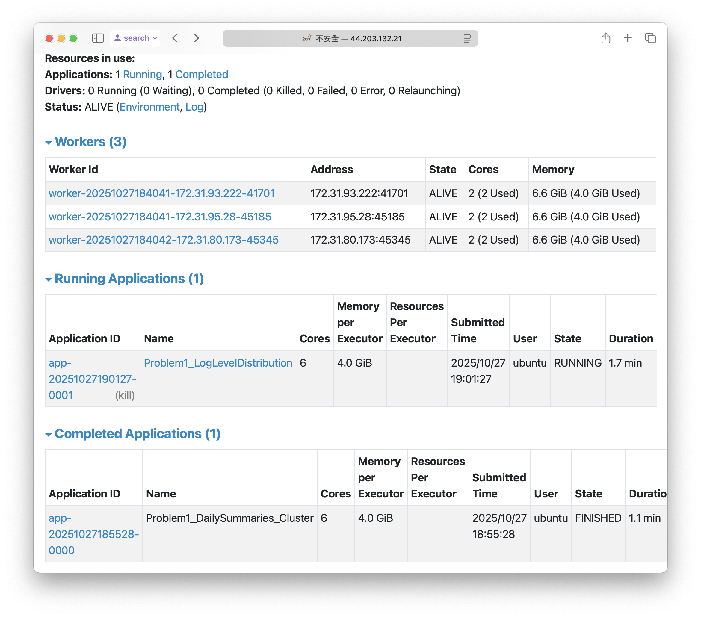
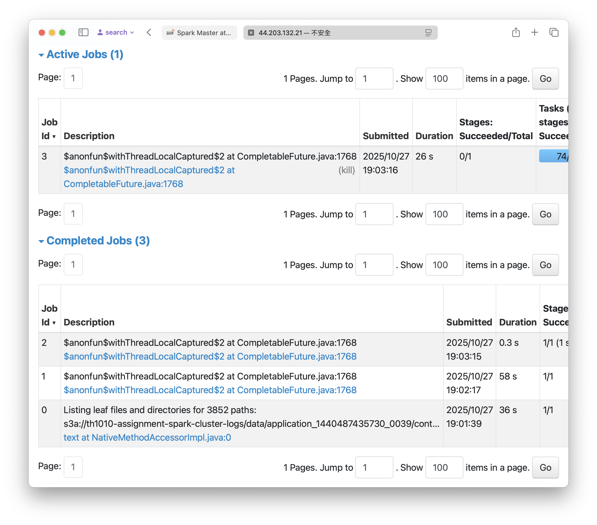

## Analysis Report

### Brief description of your approach for each problem and Performance observations (execution time, optimizations)

Scripts for problem 1 and 2 are both built on the structure of `nyc_tlc_cluster.py`, aiming to keep detailed execution logs and screen outputs, in order to track progress and to support debugging and optimization.

For problem 1, my approach to address issues like log format variations and multi-line log entries is to use `pyspark.sql.Column.rlike` as a filter condition to retain only the lines that begin with timestamps.
After running the problem 1 solution, I found that the execution time was longer than expected (about 6 minutes), even though I've actually downsampled the number of lines that I needed to go through. Therefore, in problem 2 solution, I tried to chain dataframe operations together, leaving the Spark's to figure out an optimized query plan. In addition, seeing that the code will be accessing logs_parsed dataframe as well as app_df dataframe multiple times, and the expensive or wide dependency operations such as counting grouping were also involved, thus, I decided to try caching these dataframes such that the result of counting is remembered.

### Key findings and insights from the data and Explanation of the visualizations generated in Problem 2

The log data that this analysis is looking at contains logs that recorded running Spark applications using YARN cluster manager, including applications from 2015 to 2017.

The analysis from problem 1 shows that there are only INFO, WARN and ERROR log entries, with the absence of DEBUG entries. Most of the logs are INFO-level logs, taken up over 99% of all log entries. Yet, the counts for WARN and ERROR leevels are likely underestimated because such logs may have nonstandard formats and may span multiple lines. The sampled log messages also helps understanding runnning Spark on YARN compared to standalone deployment of Spark.

For problem 2, there are 6 unique clusters in the dataset. The barplot (fig1) shows that among the 194 applications, 181 use the 1485248649253 cluster. Cluster 1485248649253 was used throughout 2017 January to 2017 July, while the other 5 clusters saw usage only within a day. Most applications took about 15 minutes to execute, though execution times can range from less than a minute to more than 15 hours. The density plot (fig2) provides us the views showing that the execution times of the applications is approximately log-normally distributed, with most of the applications taken 15 to 18 minutes to execute, also with a noticeable fat left tail representing longer execution times.

### Screenshots of Spark Web UI showing job execution

